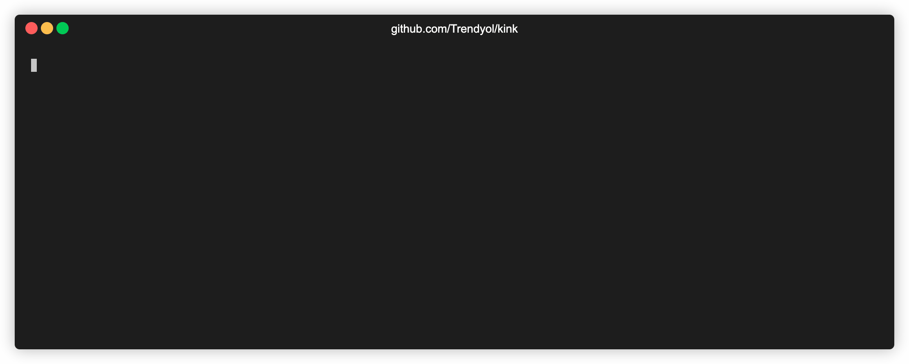

<p align="center">
  
  <h3 align="center">kink</h3>
  <p align="center">A helper CLI that facilitates to manage KinD clusters as Kubernetes pods.</p>
  <p align="center">
  <a href="https://opensource.org/licenses/Apache-2.0"></a>
  <a href="https://goreportcard.com/report/github.com/Trendyol/kink"></a>
  <a href="https://github.com/Trendyol/kink/actions?workflow=test"></a>
  <a href="https://github.com/Trendyol/kink/releases/latest"></a>
    <a href="https://github.com/Trendyol/kink/"></a>
</p>
</p>

---

<!-- START doctoc generated TOC please keep comment here to allow auto update -->
<!-- DON'T EDIT THIS SECTION, INSTEAD RE-RUN doctoc TO UPDATE -->




## Table of Contents

- [kink (KinD in Kubernetes)](#kink-kind-in-kubernetes)
    - [Introduction](#introduction)
    - [How it works ?](#how-it-works-)
        - [Architectural Diagram](#architectural-diagram)
    - [Installation](#installation)
    - [Quick Start](#quick-start)
        - [List supported Kubernetes versions](#list-supported-kubernetes-versions)
        - [Run KinD cluster](#run-kind-cluster)
        - [List KinD clusters](#list-kind-clusters)
        - [Delete KinD clusters](#delete-kind-clusters)
    - [Autocompletion Support](#autocompletion-support)
        - [Bash](#bash)
        - [Zsh](#zsh)
        - [fish](#fish)
        - [PowerShell](#powershell)

<!-- END doctoc generated TOC please keep comment here to allow auto update -->

## Introduction

Before getting started into the **_kink_**, we should talk about a bit [KinD](https://kind.sigs.k8s.io) first who is not
familiar with this project. **_KinD_** is a tool for running local Kubernetes clusters using Docker container **_
nodes_**. **_KinD_** was primarily designed for testing Kubernetes itself, but may be used for local development or CI.

So, what is **_kink_** then, where does this idea come from?

**_kink_** is a CLI application that facilitates to run KinD cluster in Kubernetes Pod and also manages the whole
lifecycle of these clusters such as by listing them, deleting them, etc. There is a very detailed guide about how you
can run KinD cluster in a Pod, for more detail,
please [see](https://d2iq.com/blog/running-kind-inside-a-kubernetes-cluster-for-continuous-integration) because this is
where the idea came from.

The idea is that when you want to run ephemeral clusters by using projects like KinD in your CI/CD system instead of
having Kubernetes clusters, because it might cost more, you might want to run your KinD cluster in a Pod, especially if
you are using Gitlab as a CI/CD solution and running your jobs as Kubernetes Pod. This project specifically aims to
solve that problem. By using **_kink_**, you can easily manage whole lifecycle of your KinD cluster no matter how many
they are as Kubernetes Pod.

## How it works ?

### Architectural Diagram


**_kink_** is a just a wrapper around managing Docker images which are purposely built to run **_KinD_** on Kubernetes
clusters inside a Pod. As I mentioned above, there is very detailed guide that explains all the necessary details to
run **_Kind_** on Kubernetes clusters inside Pod. So, there are some Docker images which we maintained
it [here](https://gitlab.trendyol.com/platform/base/poc/running-kind-cluster-in-pod-images). In this repository, we are
providing Docker images for different version
of [Docker](https://gitlab.trendyol.com/platform/base/poc/running-kind-cluster-in-pod-images/-/blob/master/dind/Dockerfile.buster#L3)
and [Kubernetes](https://gitlab.trendyol.com/platform/base/poc/running-kind-cluster-in-pod-images/-/blob/master/kind-cluster/node/Dockerfile#L1)
. Then, **_kink_** allows you to create Kubernetes Pods based on Docker images we provide and connect to the cluster
running inside a Pod. In order the connect to the cluster running inside a Pod, **_kink_** does some tricks such as
creating **_Kubernetes Service_**
and [adding node IP](https://github.com/Trendyol/kink/-/blob/master/cmd/run.go#L145-152) which is scheduled on to
the [CERT_SANS](https://gitlab.trendyol.com/platform/base/poc/running-kind-cluster-in-pod-images/-/blob/master/kind-cluster/entrypoint-wrapper.sh#L17)
addresses to make the connection secure over HTTPS.

> **_kink_** uses labels to follow the user activities because we have to provide multi-tenancy support for our users in order to avoid stepping each other toes in same Kubernetes environment,
> you can see the label which we are currently using to achieve uniqueness.
> https://github.com/Trendyol/kink/-/blob/master/cmd/run.go#L91

## Installation

If you have Go 1.16+, you can directly install by running:

```shell
$ export GOPRIVATE="gitlab.trendyol.com"
$ go install github.com/Trendyol/kink@latest
```

**Note:** _Since we already sign the binaries and images using [cosign](https://github.com/sigstore/cosign), you can easily verify by using our [public key](https://raw.githubusercontent.com/Trendyol/kink/main/cosign.pub): `$ cosign verify -k ./cosign.pub] <FILE>`._

and the resulting binary will be placed at $HOME/go/bin/kink.

## Quick Start

```shell
$ kink --help
A helper CLI that facilitates to manage KinD clusters as Kubernetes pods

Usage:
  kink [command]

Available Commands:
  completion              Generate completion script
  delete                  Ephemeral cluster could be deleted by delete command
  help                    Help about any command
  list                    List all ephemeral cluster
  list-supported-versions List all supported k8s versions
  run                     Ephemeral cluster could be created by run command
```

This shows how to:

* list supported Kubernetes versions
* pick one of these versions and run KinD cluster
* list KinD clusters
* delete KinD clusters

### List supported Kubernetes versions

```shell
$ kink list-supported-versions
v1.16.0
v1.17.0
v1.18.0
v1.20.0
v1.21.2
```

### Run KinD cluster

* Choose one of your favorite Kubernetes distribution such as KinD, Minikube, k0s, k3s, etc and run it first.

```shell
$ kind create cluster
$ kink run --timeout 360
[1/1] Creating Pod kind-cluster-f1dc1e5a-eefa-4eea-94d8-bc6a99ea20db... 100% [===============] (0.184 kB/s)
KUBECONFIG file has been written to the directory: /var/folders/pf/6h9t0mnd4d342ncgpjq_3zl80000gp/T/kink_kubeconfig642727642/kubeconfig

Thanks for using kink!
Pod kind-cluster-f1dc1e5a-eefa-4eea-94d8-bc6a99ea20db and Service kind-cluster-f1dc1e5a-eefa-4eea-94d8-bc6a99ea20db created successfully!

You can view the logs by running the following command:
$ kubectl logs -f kind-cluster-f1dc1e5a-eefa-4eea-94d8-bc6a99ea20db -n default

KUBECONFIG file generated at path '/Users/batuhan.apaydin/workspace/projects/trendyol/kink/kubeconfig'.
Start managing your internal KinD cluster by running the following command:
$ KUBECONFIG=/Users/batuhan.apaydin/workspace/projects/trendyol/kink/kubeconfig kubectl get nodes -o wide%
```

### List KinD clusters

```shell
$ kink list
NAMESPACE   NAME                                                    AGE    LABELS
default     pod/kind-cluster-f1dc1e5a-eefa-4eea-94d8-bc6a99ea20db   3d4h   generated-uuid=f1dc1e5a-eefa-4eea-94d8-bc6a99ea20db,runned-by=batuhan.apaydin_C02DM1U3MD6R
```

### Delete KinD clusters

* You can delete all the KinD clusters that you provisioned:

```shell
$ kink delete --all --force
Pod kind-cluster-f1dc1e5a-eefa-4eea-94d8-bc6a99ea20db and Service kind-cluster-f1dc1e5a-eefa-4eea-94d8-bc6a99ea20db will be deleted... Do you accept? (y/N) y
Deleting Pod kind-cluster-f1dc1e5a-eefa-4eea-94d8-bc6a99ea20db
```

* or you can delete one of them:

```shell
$ kink delete --name kind-cluster-f1dc1e5a-eefa-4eea-94d8-bc6a99ea20db
Pod kind-cluster-f1dc1e5a-eefa-4eea-94d8-bc6a99ea20db and Service kind-cluster-f1dc1e5a-eefa-4eea-94d8-bc6a99ea20db will be deleted... Do you accept? (y/N) y
Deleting Pod kind-cluster-f1dc1e5a-eefa-4eea-94d8-bc6a99ea20db
```

## Autocompletion Support

To load completions:

### Bash

```shell
$ source <(kink completion bash)

# To load completions for each session, execute once:
# Linux:
$ kink completion bash > /etc/bash_completion.d/kink
# macOS:
$ kink completion bash > /usr/local/etc/bash_completion.d/kink
```

### Zsh

```shell
# If shell completion is not already enabled in your environment,
# you will need to enable it.  You can execute the following once:

$ echo "autoload -U compinit; compinit" >> ~/.zshrc

# To load completions for each session, execute once:
$ kink completion zsh > "${fpath[1]}/_kink"

# You will need to start a new shell for this setup to take effect.
```

### fish

```shell
$ kink completion fish | source

# To load completions for each session, execute once:
$ kink completion fish > ~/.config/fish/completions/kink.fish
```

### PowerShell

```shell
PS> kink completion powershell | Out-String | Invoke-Expression

# To load completions for every new session, run:
PS> kink completion powershell > kink.ps1
# and source this file from your PowerShell profile.
```
